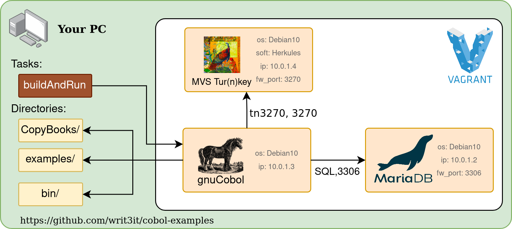

# cobol-examples
The set of cobol examples

## Requirements

PC with linux OS and Vagrant installed. If you are using Windows, translate bin/buildAndRun.sh and bin/mf-terminal.sh (or run over WSL?).

## Getting Started

1. Install Vagrant ([documentation](https://www.vagrantup.com/docs/installation)).
- Language support `ext install bitlang.cobol` ([description](https://marketplace.visualstudio.com/items?itemName=bitlang.cobol))
- GnuCobol support `ext install bitlang.gnucobol` ([description](https://marketplace.visualstudio.com/items?itemName=bitlang.gnucobol))
- COBOL flow visualization `ext install broadcomMFD.ccf` ([description](https://marketplace.visualstudio.com/items?itemName=broadcomMFD.ccf))
3. Do in the terminal `$ vagrant up`.
4. Open selected program in VSC.
5. Type `Ctrl + Shift + B`. Enjoy!
6. After work, do `$ vagrant halt` to stop virtual machines.

## Table of Contents

1. [examples/gnucobol](examples/gnucobol/README.md) - gnucobol dedicated examples
    - [basic/01_hello_world.cbl](examples/gnucobol/basic/01_hello_world.cbl) - Greeting the World!
2. [examples/mainframe](examples/mainframe/README.md) - Hercules dedicated examples
    - [basic/01_hello_world.cbl](examples/mainframebasic/01_hello_world.cbl) - Greeting the World!
3. Mainframe/Printers - Hercules printers output files
    - prt00e.txt - A device

## Environment architecture

## Building (Ctrl+Shift+B)

When you type `Ctrl + Shift + B`, vscode will execute build task that runs buildAndRun.sh. That magic script looking for JCL corresponding to your CBL file. If the JCL is found then your program will be transfer to the mainframe and submit using JCL. If not, your program will be compile with gnuCobol. Each CBL file is precompiled with esqlOC.

## ATTENTION

This repository is under development. Currently building a program using the mainframe does not support copybooks. The connection to mariadb has not been tested. VMs builded with Vagrantfile are not secured. Do not use them for sensitive data or production purposes.

## Important questions and answers

### What is the mainframe?

The mainframe is a large computer designed to process large amounts of business data and I/O operations. [Detailed answer.](https://www.youtube.com/watch?v=eGlC3WXL8FQ)

### Why mainframe variant of buildAndRun is so weird?

The actual compilation and running of the program are run in the job queue processed by the mainframe. This makes the process asynchronous to VSCode. Also for this reason, the program output is available on the output device (usually the printer) and not on the terminal. [Compilation using the old mainframe. Hercules works similarly.](https://www.youtube.com/watch?v=uFQ3sajIdaM)

### How to log into Hercules?

Type `./bin/mf-terminal.sh` in your terminal. The default user (f.e.) is HERC02 (password: CUL8TR). After finishing work *REMEMBER* to *LOGOFF* (before disconnecting).

## Usefull docs

1. [Picture symbols](docs/picture_symbols.md)
2. [Awesome COBOL list!](https://github.com/writ3it/awesome-cobol)